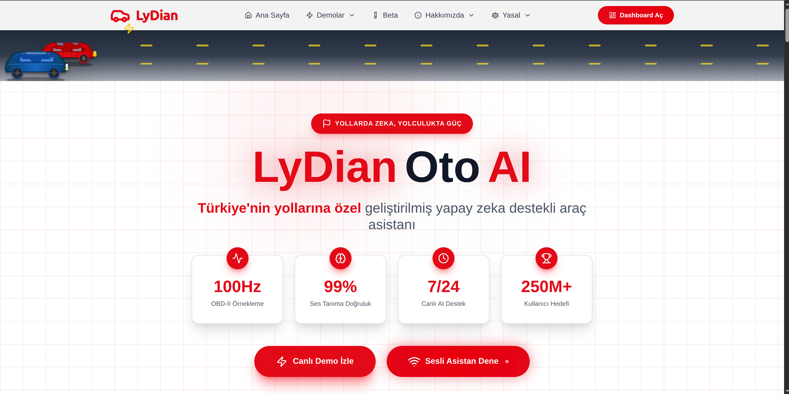
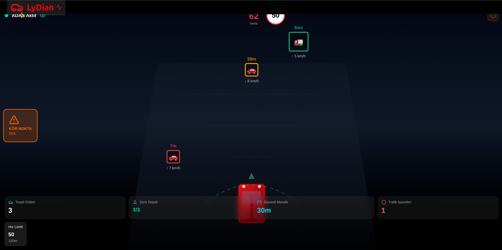
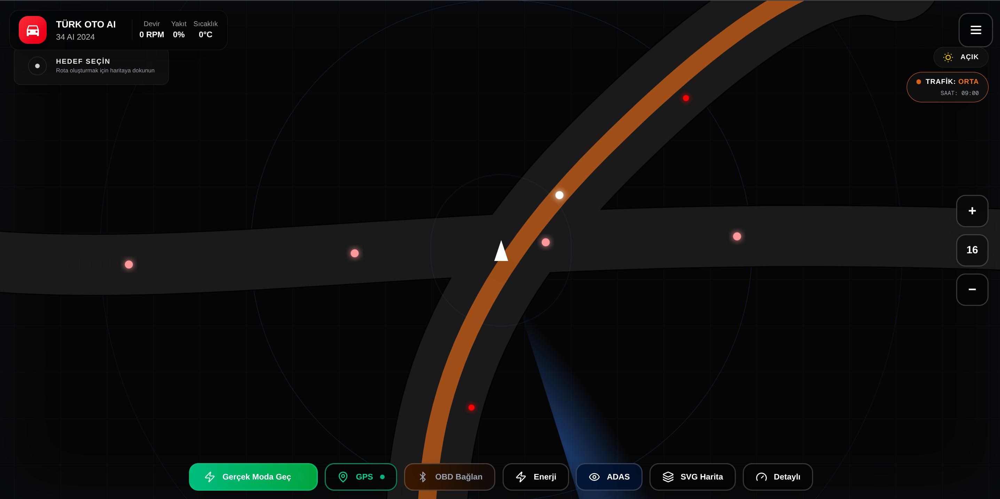
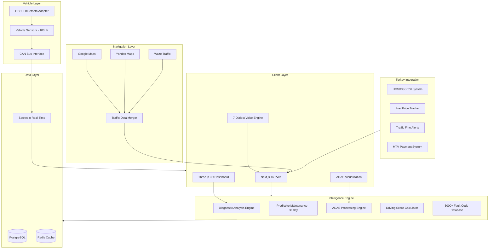

<div align="center">
  
  <br><br>

# OtoAI (TurkOto)

### Intelligent Connected Vehicle Platform with Real-Time OBD-II Diagnostics & 7-Dialect Voice Control
### Gercek Zamanli OBD-II Teshis ve 7 Lehce Sesli Kontrol ile Akilli Bagli Arac Platformu

[](https://otoail.ailydian.com)
[]()
[]()
[]()

</div>

---

## Preview

<div align="center">
  
  <br><em>OtoAI - Intelligent Vehicle Assistant for Turkish Roads: 100Hz OBD-II, 99% Voice Accuracy, 7/24 Live Support</em>
</div>

<br>

<div align="center">
  
  <br><em>Real-Time OBD-II Dashboard - RPM, Speed, Fuel Consumption, Temperature, Battery, Power, Efficiency at 100Hz</em>
</div>

<br>

<div align="center">
  
  <br><em>ADAS Driving View - Vehicle Detection, Blind Spot Warnings, Safe Distance Monitoring, Speed Limit Alerts</em>
</div>

<br>

<div align="center">
  
  <br><em>Intelligent Navigation - Real-Time Traffic, Multi-Source Maps, GPS Integration, SVG Map Rendering</em>
</div>

<br>

<div align="center">
  
  <br><em>6 Core Features: Voice Assistant, Smart Diagnostics, Super Navigation, Driving Score, Turkey Integration, Predictive Maintenance</em>
</div>

---

## Executive Summary

OtoAI (TurkOto) is a comprehensive connected vehicle intelligence platform that transforms any car with an OBD-II port into a smart, voice-controlled vehicle with real-time diagnostics, ADAS-like safety features, and predictive maintenance. The platform reads 100Hz telemetry from the vehicle's OBD-II Bluetooth adapter, processes it through proprietary analysis algorithms, and delivers actionable insights through a 7-dialect Turkish voice assistant with 99% recognition accuracy.

The platform goes far beyond basic OBD-II readers. OtoAI provides a full ADAS (Advanced Driver Assistance System) simulation with vehicle detection, blind spot warnings, and safe distance monitoring -- features typically available only in $50K+ luxury vehicles. Combined with intelligent navigation that merges Google Maps, Yandex Maps, and Waze data for Turkey-specific traffic optimization, plus deep integration with Turkish systems (HGS/OGS toll, fuel prices, traffic fines, MTV payments), OtoAI is the definitive connected car platform for the Turkish market.

With 25M+ registered vehicles in Turkey and a growing global connected car market projected to reach $191B by 2028, OtoAI targets a freemium consumer app model plus OEM licensing at $2-5/vehicle/year. The platform's 5,000+ fault code database with repair cost estimates and 30-day predictive maintenance forecasting creates a data moat that strengthens with every vehicle connected.

## Yonetici Ozeti

OtoAI (TurkOto), OBD-II portu olan herhangi bir araci gercek zamanli teshis, ADAS benzeri guvenlik ozellikleri ve ongorucu bakim ile akilli, sesle kontrol edilen bir araca donusturen kapsamli bir bagli arac zeka platformudur. Platform, aracin OBD-II Bluetooth adaptorunden 100Hz telemetri okur, tescilli analiz algoritmalariyla isler ve %99 tanima dogruluguyla 7 lehceli Turkce sesli asistan araciligiyla eyleme donusturulebilir bilgiler sunar.

OtoAI, temel OBD-II okuyucularin cok otesine gider: arac tespiti, kor nokta uyarilari ve guvenli mesafe izleme ile tam ADAS simulasyonu saglar - normalde yalnizca 50.000$+ luks araclarda bulunan ozellikler. Turkiye'ye ozel trafik optimizasyonu icin Google Maps, Yandex Maps ve Waze verilerini birlestiren akilli navigasyon ve Turk sistemleriyle derin entegrasyon (HGS/OGS, yakit fiyatlari, trafik cezalari, MTV odemeleri) ile OtoAI, Turk pazari icin kesin bagli arac platformudur. 25M+ kayitli arac ile freemium tuketici uygulamasi ve OEM lisanslama (arac basina yillik 2-5$) hedeflemektedir.

---

## Key Metrics

| Metric | Value |
|--------|-------|
| OBD-II Sampling Rate | 100Hz Real-Time |
| Voice Recognition Accuracy | 99% (7 Turkish dialects) |
| Fault Code Database | 5,000+ with repair guidance |
| Predictive Maintenance | 30-day forecast window |
| ADAS Features | Vehicle detection, blind spot, safe distance |
| Navigation Sources | Google Maps + Yandex + Waze (merged) |
| Turkey Integrations | HGS/OGS, fuel prices, traffic fines, MTV |
| Supported Vehicles | Any OBD-II compatible (1996+) |

---

## Revenue Model & Projections

### Business Model

**Freemium Consumer App** with premium subscriptions + **OEM Licensing** at $2-5/vehicle/year for automotive manufacturers and fleet operators.

| Tier | Price | Features |
|------|-------|----------|
| Free | $0 | Basic OBD-II reading, fault codes, fuel tracking |
| Premium | $4.99/mo | ADAS, voice assistant, predictive maintenance, navigation |
| Pro Driver | $9.99/mo | Driving score, insurance discounts, fleet features |
| OEM License | $2-5/vehicle/year | White-label, embedded integration, bulk data |
| Fleet Enterprise | Custom | API access, fleet dashboard, bulk management |

### 5-Year Revenue Forecast

| Year | Users | ARR | YoY Growth |
|------|-------|-----|------------|
| Y1 | 10K-25K | $200K | - |
| Y2 | 50K-100K | $800K | 300% |
| Y3 | 200K-500K | $3M | 275% |
| Y4 | 500K-1M | $8M | 167% |
| Y5 | 1M-3M | $20M | 150% |

---

## Market Opportunity

| Segment | Size |
|---------|------|
| **TAM** - Global Connected Car Market | $191B (2028) |
| **SAM** - Consumer OBD-II & Vehicle Telematics | $25B |
| **SOM** - Turkey + MENA Connected Vehicle Apps | $2B (first 5 years) |

**Key Market Drivers:**
- 25M+ registered vehicles in Turkey, 90%+ have OBD-II ports
- Connected car market growing at 17.1% CAGR (2024-2028)
- ADAS features available only in top 5% of vehicles by price
- Insurance companies offering 15-20% discounts for telematics data
- Turkish government mandating vehicle inspection digitization

---

## Tech Stack

<p>
  
  
  
  
  
  
  
  
  
  
</p>

---

## Competitive Advantages

- **ADAS for Every Car**: Brings $50K+ luxury vehicle safety features (vehicle detection, blind spot, safe distance) to any car with a $20 OBD-II adapter
- **7-Dialect Voice Recognition**: Only vehicle platform supporting Istanbul, Ankara, Izmir, Black Sea, Southeast, Mediterranean, and Aegean Turkish dialects at 99% accuracy
- **5,000+ Fault Code Intelligence**: Not just error codes but repair cost estimates, urgency ratings, and nearest mechanic recommendations
- **Turkey-Native Integration**: HGS/OGS toll, fuel price comparison, traffic fine alerts, MTV payment reminders, and insurance discount partnerships
- **100Hz Telemetry Moat**: High-frequency data collection creates a proprietary dataset for predictive maintenance models that improve with every connected vehicle

---

## Architecture



---

## Getting Started

```bash
# Clone the repository
git clone https://github.com/lydianai/otoail.ailydian.com.git
cd otoail.ailydian.com

# Install dependencies
npm install

# Set up environment variables
cp .env.example .env.local
# Configure DATABASE_URL, MAPS_API_KEY, OBD_BLUETOOTH_CONFIG

# Generate Prisma client
npx prisma generate

# Run development server
npm run dev

# Production build
npm run build && npm start
```

---

## Security & Compliance

| Standard | Status | Details |
|----------|--------|---------|
| Vehicle Data Privacy | Compliant | All OBD-II data encrypted, user-owned |
| OWASP Top 10 | Verified | Input validation, secure WebSocket |
| Encryption | AES-256 + TLS 1.3 | Data at rest and in transit |
| Bluetooth Security | BLE 5.0 | Encrypted OBD-II communication |
| KVKK/GDPR | Uyumlu | Turkish & EU data protection |
| CCPA | Ready | California consumer privacy |

---

## Contact

| | |
|---|---|
| **Email** | info@ailydian.com |
| **Email** | ailydian@ailydian.com |
| **Web** | https://ailydian.com |
| **Platform** | https://otoail.ailydian.com |

---

## License

Copyright (c) 2025-2026 AiLydian. All Rights Reserved.

This software is proprietary and confidential. Unauthorized copying, distribution, or modification of this software, via any medium, is strictly prohibited. Licensed under consumer subscription and OEM licensing agreements.
