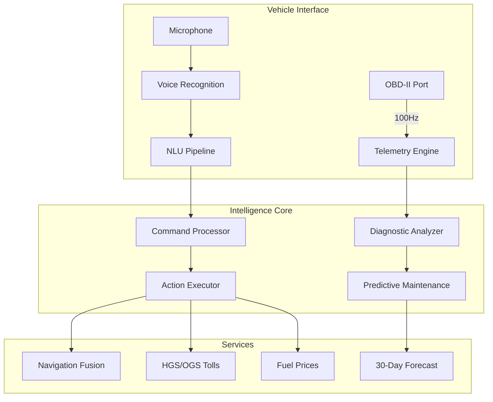

<div align="center">

# TurkOto

<p><em>Intelligent Vehicle Assistant with Real-Time OBD-II Diagnostics and 7-Dialect Voice Control</em></p>

<p>
  <a href="#overview"></a>
  <a href="#architecture"></a>
  <a href="#key-features"></a>
  <a href="#getting-started"></a>
</p>

<p>
  
  
  
  
  
  
</p>

<table>
<tr>
<td width="50%">

**Platform Highlights**
- Real-time OBD-II telemetry at 100Hz sampling rate
- 7 Turkish regional dialect voice recognition
- 30-day predictive maintenance forecasting
- HGS/OGS toll system and fuel price integration

</td>
<td width="50%">

**Technical Excellence**
- Next.js 16 with Socket.io real-time streaming
- Three.js 3D vehicle visualization dashboard
- PostgreSQL + Prisma ORM with Redis caching
- 5,000+ fault code database with repair guidance

</td>
</tr>
</table>

</div>

---

## Overview

TurkOto is an intelligent vehicle assistant platform purpose-built for the Turkish market. It combines real-time OBD-II telemetry at 100Hz sampling rate, multi-dialect voice recognition, and predictive maintenance intelligence to deliver a next-generation in-vehicle experience.

Unlike generic automotive platforms, TurkOto integrates Turkey-specific infrastructure services including HGS/OGS toll systems, live fuel price feeds, and traffic fine lookups. A 3D vehicle dashboard visualization provides an intuitive representation of vehicle health and system status.

---

## Architecture



---

## Key Features

### Real-Time OBD-II Telemetry
- 100Hz sampling rate for real-time vehicle data streaming
- Full PID coverage: engine RPM, coolant temperature, throttle position, MAF sensor, O2 sensors, fuel trim
- DTC (Diagnostic Trouble Code) real-time detection and lookup
- 5,000+ fault code database with repair guidance
- Freeze frame data capture on fault events
- WebSocket streaming to dashboard

### Voice Recognition - Turkish Dialects
- 7 regional dialect support: Istanbul, Ankara, Izmir, Black Sea, Eastern, GAP, Aegean
- 99% recognition accuracy on in-vehicle noise conditions
- 50+ message context memory for natural multi-turn conversations
- Wake word activation (hands-free operation)
- Command categories: navigation, diagnostics, calls, media, vehicle controls

### Predictive Maintenance
- 30-day failure probability forecasting based on telemetry trends
- Component-level risk scoring: battery, brake pads, belts, filters, tires
- Service interval tracking with dealer network integration
- Maintenance history timeline
- Cost estimation for upcoming service items

### Navigation Fusion
- Combined routing from Google Maps, Yandex Maps, and Waze simultaneously
- Best-route selection based on real-time traffic conditions
- Turkey-specific routing: ferry terminals, toll gates, mountain pass conditions
- Offline map support for low-connectivity areas

### Turkey-Specific Services
- **HGS/OGS Integration**: Real-time toll balance and transaction history
- **Fuel Prices**: Live prices at 10,000+ stations across Turkey
- **Traffic Fines**: License plate lookup for outstanding violations
- **Vehicle Inspection**: TUVTURK appointment scheduling
- **Insurance**: Policy lookup and renewal reminders

### 3D Vehicle Dashboard
- Photorealistic 3D vehicle model with system overlays
- Interactive component inspection (click any part for status)
- Animated indicators for active alerts
- Powered by Three.js + React Three Fiber

---

## Tech Stack

<div align="center">

| Layer | Technology | Badge |
|-------|-----------|-------|
| Framework | Next.js 16 (App Router) |  |
| UI Library | React 19 |  |
| Language | TypeScript (strict mode) |  |
| 3D Engine | Three.js + React Three Fiber |  |
| Real-time | Socket.io |  |
| Cache | Redis (ioredis) |  |
| Database | PostgreSQL + Prisma ORM |  |
| Maps | Google Maps API |  |
| Auth | NextAuth.js |  |
| Validation | Zod |  |

</div>

---

## Getting Started

### Prerequisites

- Node.js 20+
- PostgreSQL 15+
- Redis 7+
- npm

### Installation

```bash
git clone https://github.com/lydianai/otoail.ailydian.com.git
cd otoail.ailydian.com
npm install
```

### Environment Setup

```bash
cp .env.example .env.local
```

Required environment variables:
```env
DATABASE_URL=postgresql://...
REDIS_URL=redis://...
NEXTAUTH_SECRET=...
NEXTAUTH_URL=http://localhost:3000
GOOGLE_MAPS_API_KEY=...
```

### Database Setup

```bash
npm run prisma:migrate
npm run prisma:seed
```

### Development

```bash
npm run dev
# Next.js + Socket.io server starts on http://localhost:3000
```

### Production Build

```bash
npm run build
npm start
```

---

## Project Structure

```
otoail.ailydian.com/
├── app/                    # Next.js 16 App Router
│   ├── (dashboard)/        # Main vehicle dashboard
│   ├── (diagnostics)/      # OBD-II diagnostic views
│   ├── (services)/         # HGS, fuel, traffic pages
│   └── api/                # API routes
├── components/
│   ├── dashboard3d/        # Three.js vehicle visualization
│   ├── telemetry/          # OBD-II real-time displays
│   ├── voice/              # Voice recognition UI
│   └── maps/               # Navigation components
├── lib/
│   ├── obd/                # OBD-II protocol parsing
│   ├── voice/              # Speech recognition pipeline
│   ├── predictive/         # Maintenance forecasting
│   └── services/           # HGS, fuel, traffic APIs
├── prisma/                 # Database schema and migrations
├── server.js               # Custom server with Socket.io
└── types/                  # Shared TypeScript types
```

---

## Security

Security vulnerabilities should be reported privately. See [SECURITY.md](SECURITY.md) for our responsible disclosure policy.

---

## License

Copyright (c) 2024-2026 Lydian (AiLydian). All Rights Reserved.

This software is proprietary. See [LICENSE](LICENSE) for full terms.

---

## Contact

- Website: [https://www.ailydian.com](https://www.ailydian.com)
- Email: [contact@ailydian.com](mailto:contact@ailydian.com)
